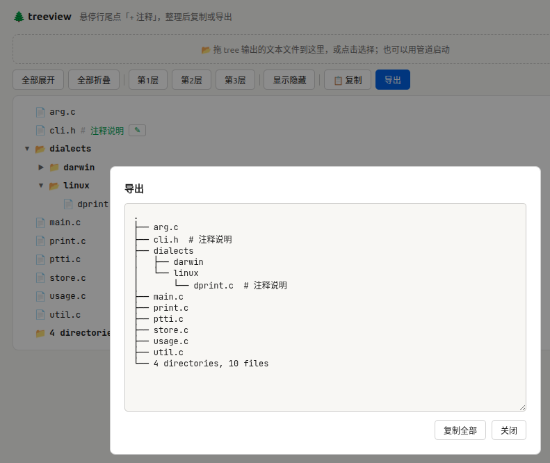

# treeview

  

`treeview` 是一个用于整理 `tree` 命令输出的本地交互式目录树工具。它把命令行里的目录结构变成浏览器里的可展开视图，支持添加注释、隐藏或删除不需要的目录和文件，然后按当前视图复制或导出为文本。

它适合用在写文档、整理项目结构、给代码仓库做说明、筛选大型固件或源码目录时，把原始 `tree` 输出快速整理成更干净、更可读的目录说明。

## 主要功能

- 通过管道读取 `tree` 输出：

```bash
tree | ./treeview
tree -L 3 | ./treeview
cat tree.txt | ./treeview
```

- 也可以在页面中拖入或点击选择保存好的 `tree` 文本文件。
- 支持展开、折叠、全部展开、全部折叠，以及按第 1/2/3 层快速展开。
- 支持给任意目录或文件添加注释。
- 支持隐藏目录或文件；隐藏内容不会被复制和导出，可以通过“显示隐藏”恢复。
- 支持删除目录或文件；删除会移除该节点及其子项。
- 复制和导出按“当前视图”生成文本，只包含当前可见内容，并保留注释。
- 在 Linux 下通过后端 `file` 命令按需修正叶子节点类型，让无扩展名文本文件不再误显示为目录。

## 工作原理

项目由两个文件组成：

- `treeview`：Python 启动器。
- `treeview.html`：浏览器端 UI、解析器和交互逻辑。

使用管道启动时，`treeview` 会从标准输入读取完整的 `tree` 文本，在本机随机端口启动一个临时 HTTP 服务，并自动打开浏览器。

浏览器访问主页时只加载轻量的 `treeview.html`。目录文本不会被直接塞进 HTML，而是通过 `/data` 接口异步获取。页面拿到原始文本后，在前端解析成树形数据结构，再根据展开状态渲染成可交互的目录树。

对于最后一层没有子项的节点，前端会按需请求 `/type?path=...`。Python 后端会用 `stat` 和 Linux `file -b --mime-type` 判断真实类型，并把结果返回给页面修正图标。相对路径按启动目录解析，绝对路径按原路径解析，因此 `tree ./` 和 `tree /abs/path` 都可以修正叶子节点图标。

拖文件使用的是浏览器 `FileReader`，文件内容只在本机页面中读取和解析，不需要上传到任何外部服务。

## 解析规则

解析器支持常见 `tree` 输出格式，例如：

```text
.
├── src
│   ├── index.js
│   └── utils
│       └── helper.js
└── README.md
```

它会根据 `├──`、`└──` 前面的缩进前缀计算层级，并兼容 `tree` 输出中常见的不间断空格。如果 `tree` 输出第一行是一个根目录名，例如 `tiangong0`，它会作为唯一顶层根节点显示，后续 `├──` / `└──` 行都会挂到这个根节点下面。

对于 `tree -F` 输出，带 `/` 的节点会识别为目录；对于被 `tree -L` 截断后没有子项的叶子节点，会先通过文件名特征快速判断，再由后端 `file` 探测真实类型。`7 directories, 4 files` 这样的 `tree` 摘要行不会作为目录节点显示，而是放到页面摘要信息中。

注释格式使用：

```text
├── src  # 源码目录
└── README.md  # 项目说明
```

## 性能设计

这个工具针对大型目录树做了几处关键优化，目标是在十几万行 `tree` 输出下仍然保持可用：

- **数据异步加载**：管道模式下，目录数据通过 `/data` 单独获取，避免把超大字符串内嵌进 HTML，减少页面首次加载压力。
- **无输入框大文本回填**：页面不再把原始 `tree` 内容写入 `<textarea>`，避免浏览器渲染巨大文本输入框造成卡顿。
- **懒渲染 DOM**：折叠目录不会创建子节点 DOM，只有展开时才渲染当前分支。
- **按需类型探测**：只有渲染到页面上的叶子节点才请求后端类型判断，避免对大型目录树一次性执行大量 `file` 命令。
- **按当前视图复制**：复制和导出只遍历当前展开且未隐藏的内容，不会无意义处理整棵树。
- **解析时顺手统计**：初始目录和文件数量在解析过程中生成，避免首屏渲染后再完整遍历一次树。
- **统计缓存**：普通展开和折叠不会重复全树统计；只有隐藏、删除、切换隐藏显示等会影响统计的操作才重新计算。

需要注意的是，“全部展开”会让浏览器实际创建所有可见行的 DOM。如果目录树有十几万行，全部展开仍然会明显变慢，这是浏览器 DOM 数量本身的成本。整理大型目录时，推荐使用逐级展开或“第1层 / 第2层 / 第3层”。

## 安装

直接在项目目录中使用：

```bash
chmod +x treeview
tree | ./treeview
```

也可以放到 `PATH` 目录中：

```bash
sudo mv treeview /usr/local/bin/treeview
sudo cp treeview.html /usr/local/bin/treeview.html
```

或者放到用户目录：

```bash
mkdir -p ~/.local/bin
cp treeview treeview.html ~/.local/bin/
chmod +x ~/.local/bin/treeview
```

确保 `treeview` 和 `treeview.html` 在同一个目录，因为启动脚本会从自身所在目录加载 HTML 文件。

## 使用建议

大型项目可以先限制深度：

```bash
tree -L 3 | ./treeview
```

如果想让叶子目录识别更准确，可以使用：

```bash
tree -F | ./treeview
```

整理完成后，点击“复制”即可得到当前视图中的目录文本。复制结果会包含注释，排除隐藏内容，并保持树形缩进。
